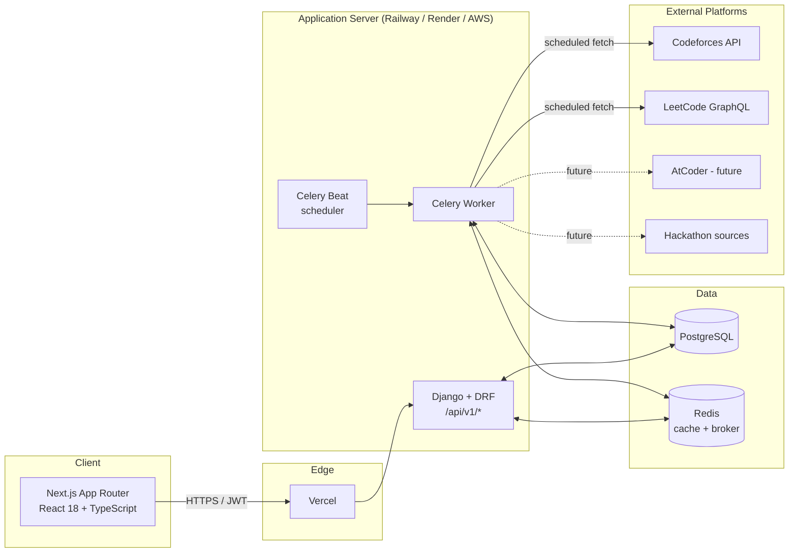

# CodeTrack Pro — Architecture (Phase 1)

## System overview



## Why this shape

**Next.js talks only to Django, never directly to Codeforces/LeetCode.** Third-party
rate limits, auth tokens, and response shapes are the backend's problem. The frontend
only ever sees our own stable `/api/v1/*` contract — this is what lets us add AtCoder
or CodeChef later without touching a single frontend component.

**All external syncing happens in Celery, not in request/response cycle.** Fetching
a user's full Codeforces submission history can take seconds; no page load should
block on that. `celery_beat` schedules hourly/daily/nightly jobs (see
`config/celery.py`), and each domain app will own its own `tasks.py` (added as that
app is built out, starting with `apps.accounts` in Phase 5).

**Redis serves two distinct roles** — Celery broker and Django cache backend — kept
as separate logical DBs (`/0` broker, `/1` cache) so a slow cache flush can't stall
task delivery.

**Django apps map 1:1 onto product domains**, not onto generic layers. `apps/contests`,
`apps/problems`, `apps/submissions`, etc. each get their own models, serializers,
views, urls, and (eventually) tasks. This mirrors the phase list in the product spec
directly — Phase 8 (contest tracking) touches `apps/contests` and nothing else.

**Provider interface for platforms.** Codeforces and LeetCode integrations will each
implement a common `PlatformProvider` interface (`fetch_profile`, `fetch_submissions`,
`fetch_contests`) inside `apps/accounts`. Adding AtCoder later means writing one new
provider class, not touching sync logic, models, or the frontend.

## Repository layout

```
codetrack-pro/
├── docker-compose.yml        # postgres, redis, backend, celery worker+beat, frontend
├── docs/
│   └── architecture.md       # this file
├── frontend/                 # Next.js 14 (App Router) + TS + Tailwind + shadcn/ui
│   └── src/
│       ├── app/               # routes (pages added phase by phase)
│       ├── components/        # ui/, layout/, charts/
│       ├── lib/                # api-client, utils
│       ├── store/              # Zustand stores (auth, ui state)
│       ├── hooks/               # React Query hooks per domain
│       ├── types/                # shared TS types, mirrors DRF serializers
│       └── config/                # constants, feature flags
└── backend/                   # Django 5 + DRF
    ├── config/
    │   ├── settings/            # base.py / development.py / production.py
    │   ├── urls.py                # versioned /api/v1/ router
    │   └── celery.py               # app + beat_schedule
    └── apps/
        ├── core/                    # shared utilities, base models, daily snapshots
        ├── users/                    # auth, profile
        ├── accounts/                   # connected CF/LeetCode accounts, provider interface
        ├── contests/                    # contest calendar + participation
        ├── problems/                      # problem database
        ├── submissions/                     # per-submission records, missed-problem analysis
        ├── goals/                            # goal tracker
        ├── journal/                           # CP journal
        ├── friends/                            # friends + comparisons
        ├── notifications/                       # in-app + email notifications
        └── hackathons/                            # hackathon tracker
```

## Settings strategy

`config/settings/base.py` holds everything environment-agnostic. `development.py`
and `production.py` only override what differs (debug flag, TLS/HSTS headers, email
backend). `manage.py` defaults to `development`; `wsgi.py`/`asgi.py` default to
`production` — so a misconfigured deploy fails safe toward stricter settings rather
than looser ones.

## What's deliberately NOT in this phase

- No models yet (Phase 3: Database).
- No auth endpoints yet (Phase 2: Authentication) — `SIMPLE_JWT`/`allauth` are wired
  into settings now so Phase 2 is pure app code, no config archaeology.
- No real API calls to Codeforces/LeetCode yet (Phases 5–6).
- No CI/CD pipeline yet (Phase 19: Deployment) — Dockerfiles exist now since they're
  structural, but GitHub Actions workflows come later.

## Phase 2 — Authentication (complete)

- Custom `User` model (`apps.users`) keyed on UUID, email-based login, separate
  lean `SocialAccount` table for linked Google/GitHub identities.
- JWT auth via SimpleJWT: `login/`, `login/refresh/`, `logout/` (blacklists the
  refresh token).
- Email verification uses a salted `PasswordResetTokenGenerator` subclass
  (`apps/users/tokens.py`) so a token invalidates itself the moment the email
  is verified — no separate token table needed.
- Password reset reuses Django's built-in token generator the same way.
- Google/GitHub OAuth (`apps/users/social.py`) verifies identities directly
  against each provider's API rather than going through allauth's full
  request/response flow — Google's ID token is checked via the `tokeninfo`
  endpoint, GitHub's `code` is exchanged server-side for an access token, then
  profile fetched from `/user`. First-time social login auto-creates a `User`
  with `is_email_verified=True` (the provider already verified it).
- Frontend: Zustand `auth-store` persists tokens in `localStorage` (read
  directly by the Axios interceptor in `lib/api-client.ts`); React Query hooks
  in `hooks/use-auth.ts` wrap every endpoint; `/login`, `/register`, and
  `/verify-email` pages are live.
- Verified end-to-end against a live Django server in this session: register →
  console-logged verification email → login → authenticated `/me/` all work;
  `npm run build` and `tsc --noEmit` both pass clean.

## Next phase

**Phase 3 — Database**: the full normalized schema (contests, problems,
submissions, goals, journal, revision, friends, notifications, hackathons,
daily snapshots) with proper indexes and constraints, replacing today's empty
app stubs.
